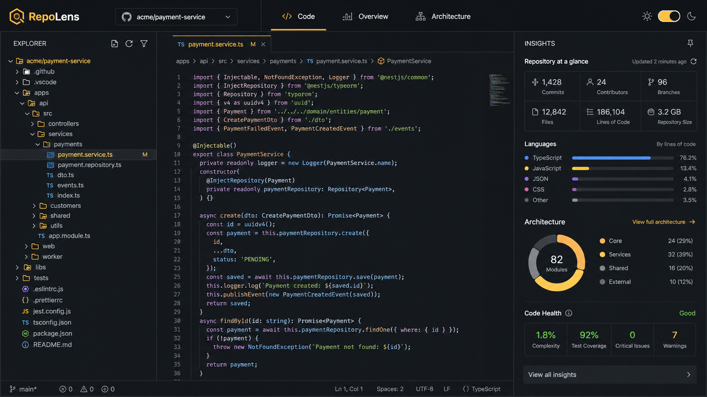

# RepoLens

[](https://github.com/ashutoshpalhare/RepoLens/actions/workflows/deploy.yml)
[](./LICENSE)
[](https://react.dev)
[](https://www.typescriptlang.org)
[](https://vitejs.dev)

> A premium, browser-based developer tool for visually exploring and understanding unfamiliar GitHub repositories.

Paste any public GitHub repository URL and get an IDE-like workspace with a file explorer, syntax-highlighted code viewer, repository insights, and a lightweight architecture map — all running client-side in your browser.



## Live Demo

**[Try RepoLens →](https://ashutoshpalhare.github.io/RepoLens/)**

## Features

- **Repository Import** — Accepts `https://github.com/owner/repo` or a bare `owner/repo` string. Handles invalid input, missing repositories, API errors, rate limits, and empty repos with clear messaging.
- **IDE-like Workspace** — Three-pane layout with a file explorer on the left, code viewer in the center, and insights panel on the right. On smaller screens, switch between Files / Code / Insights tabs.
- **File Explorer** — Collapsible folders, file-type icons, instant name filtering, and keyboard-friendly navigation.
- **Code Viewer** — Prism-based syntax highlighting with line numbers, plus graceful handling for binary, unsupported, and large files.
- **Repository Insights** — File and folder counts, language mix, repository size, largest files, config files, and structural overview.
- **Architecture Analysis** — Client-side scan of source files to detect module import relationships, external dependencies, cycles, orphans, and entry points. Runs in a background worker to keep the UI responsive on large repositories.
- **Dark-first Design** — Charcoal foundation with amber accents, strong typography, subtle animations, and full light/dark theme support.
- **GitHub Pages Ready** — Static build with relative asset paths, SPA fallback, and automated deployment via GitHub Actions.

## Tech Stack

- [React 19](https://react.dev) + [TypeScript](https://www.typescriptlang.org)
- [TanStack Start](https://tanstack.com/start) + [TanStack Router](https://tanstack.com/router) + [TanStack Query](https://tanstack.com/query)
- [Vite 7](https://vitejs.dev)
- [Tailwind CSS v4](https://tailwindcss.com)
- [Lucide React](https://lucide.dev)
- [Prism React Renderer](https://github.com/FormidableLabs/prism-react-renderer)

## Getting Started

```sh
# Install dependencies
npm install

# Start the dev server
npm run dev      # http://localhost:8080

# Build for production
npm run build
```

## Usage

1. Open the app and paste a public GitHub repository URL (e.g. `https://github.com/facebook/react`).
2. Browse the file tree on the left.
3. Click any file to view its source in the center panel.
4. Switch to **Overview** for repository stats, language breakdown, and largest files.
5. Switch to **Architecture** to explore the import-dependency graph.

## Project Structure

```
src/
  components/repolens/   UI building blocks (explorer, viewer, insights, architecture, dock)
  hooks/                 Data fetching and theme hooks
  lib/                   GitHub API client, analysis engine, parser, background worker
  routes/                Landing, about, and repository workspace routes
  types/                 Shared TypeScript types
```

API access lives in `src/lib/github.ts`. Analysis and dependency graph logic live in `src/lib/analysis.ts` and `src/lib/parse.ts`. UI components never call the network directly.

## Deploying to GitHub Pages

The included workflow at `.github/workflows/deploy.yml` builds the app with `BASE_PATH=/<repository-name>/`, adds an SPA `404.html` fallback and a `.nojekyll` marker, then publishes `dist/client` to GitHub Pages.

1. Go to **Settings → Pages** in your GitHub repository.
2. Set the source to **GitHub Actions**.
3. Push to `main`.

The workflow will run automatically and deploy your site.

## Notes on Rate Limits

RepoLens uses the public GitHub REST API without authentication. Unauthenticated requests are limited to **60 per hour per IP**. The app caches responses in memory and surfaces a clear message when the rate limit is reached.

## Architecture Overview

```
User Input  →  parseRepoInput()  →  GitHub REST API
                                    ↓
                              Repo metadata + tree
                                    ↓
                    ┌───────────────┼───────────────┐
                    ↓               ↓               ↓
              FileExplorer    CodeViewer      InsightsPanel
                    ↓               ↓               ↓
              file tree      file content    stats & languages
                    ↓               ↓
              ArchitectureView (worker-based import graph)
```

## Contributing

See [CONTRIBUTING.md](./CONTRIBUTING.md) for setup instructions, ground rules, and pull-request guidelines.

## Author

Built by **[Ashutosh Palhare](https://ashutoshpalhare.github.io)**

- [GitHub](https://github.com/ashutoshpalhare)
- [LinkedIn](https://www.linkedin.com/in/ashutoshpalhare)
- [Portfolio](https://ashutoshpalhare.github.io)
- [X / Twitter](https://twitter.com/ashutoshpalhare)

## License

[MIT License](./LICENSE) — © 2026 RepoLens contributors
